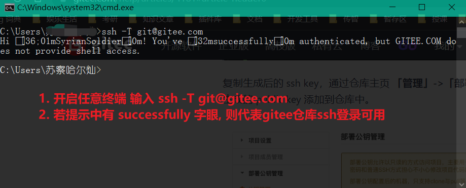
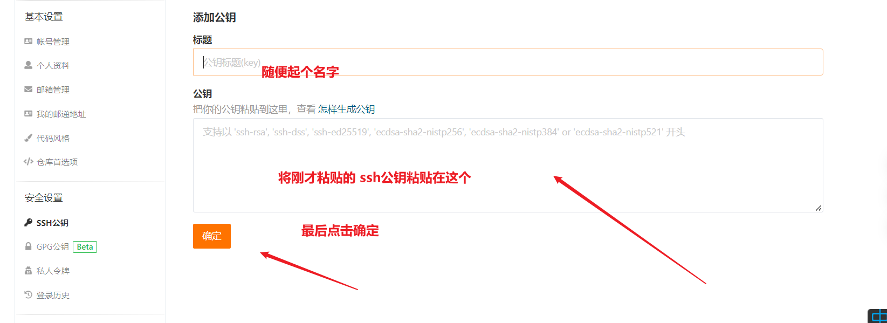

使用gitte提交作业

流程:

1. **步骤一 :** 检查是否配置SSH公钥 

   - 命令行输入 `ssh -T git@gitte.com`
   - 看是否有书scucessfully字眼, 有则代表可以正常使用SSH登录功能

   

2.  **步骤二**: 配置ssh公钥 (步骤一中有successfully字眼,则不用配置此步骤, 直接跳到步骤四)

   1. 打开   C:\Users\你自己的用户名 \\.ssh 文件夹
   2. 用VSCODE 打开.ssh文件夹下的   id_rsa.pub  文件
   3. 复制  id_rsa.pub 的内容
   4. 打开gitte官网 -->安全设置 --> SSH公钥    [gitte官网](https://gitee.com/profile/sshkeys),
   5. 

3.  **步骤三**: 重复步骤一 

   -  终端输入`ssh -T git@gitte.com`, 看见scucessfully后继续下一步骤

4.  **步骤四**

   - 新建gitte仓库
     